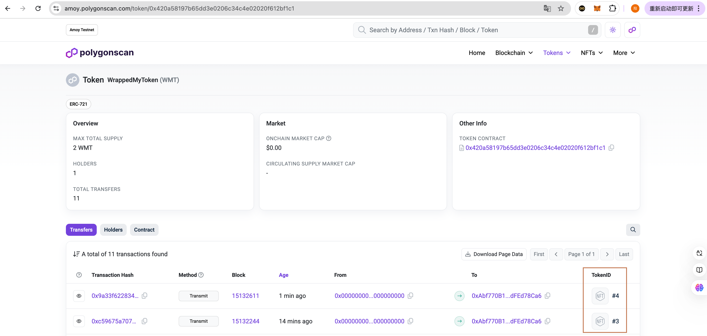

# Sample Hardhat Project

This project demonstrates a basic Hardhat use case. It comes with a sample contract, a test for that contract, and a Hardhat Ignition module that deploys that contract.

Try running some of the following tasks:

```shell
npx hardhat help
npx hardhat test
REPORT_GAS=true npx hardhat test
npx hardhat node
npx hardhat ignition deploy ./ignition/modules/Lock.js
```
<!-- TOC -->
# 第一部分 npm&hardhat使用

1、安装NVM环境，NVM是node管理器可以安装多个版本的node，并切换使用
nvm install 20 --安装版本为v20.18.0的node
nvm use 版本号 --切换使用某个版本的node

2、初始化一个npm项目
npm init -- 同时会生成一个package.json文件记录项目相关信息


3、安装hardhat
npm install hardhat --save-dev

4、在hardhat项目目录下运行
npx hardhat 


--使用键盘选择"创建一个新的hardhat.config.js（Create a JavaScript project）" ，然后回车。
这个 JavaScript Hardhat 工程会默认下载 hardhat-toolbox 插件及一些常规设置：
创建好的Hardhat工程包含文件有：
contracts：智能合约目录
scripts ：部署脚本文件
test：智能合约测试用例文件夹。
hardhat.config.js：配置文件，配置hardhat连接的网络及编译选项。

5、导入依赖库
npm install @openzeppelin/contracts --save-dev

6、修改solidity相关配置，hardhat.config.js

7、编译合约
npx hardhat compile


8、部署约合（编写运行脚本进行部署）
npx hardhat run scripts/deployVault.js

8.1、hardhat网络介绍--通过hardhat.config.js文件进行网络配置
npx hardhat run scripts/deployVault.js --network sepolia

1）通过.env配置的方式保存敏感信息(需要安装dotenv包，npm install dotenv --save-dev)

2）通过env-enc的方式进行加密配置
set env-enc set-pw 110119120
npx env-enc set 设置变量和值，require("@chainlink/env-enc").config();在hardhat.config.js进行引用（记住要const定义对应的变量参数）
9、验证合约
1)命令行验证
npx hardhat verify 合约地址 合约参数 --network sepolia

2)部署脚本里验证

2.1）增加逻辑--默认网络不需要验证skipped，sepolia网络走验证逻辑

10、hardhat测试合约
10.1 安装hardhat-deploy插件，并在hardhat.config.js中导入
利用插件进行合约的部署，减少部署的冗余代码
npm install -D hardhat-deploy

此时就有deploy命令，可以直接使用npx hardhat deploy进行部署


# 第二部分 代码技巧
1、test脚本中如何获取合约中的状态变量
```js
//合约中public类型的状态变量支持getter()特性，可以直接使用部署合约的实例调用如：vault.token()
contract Vault {
    //这里的token属性是public，自带getter()方法
    IERC20 public immutable token;
    uint256 public totalSupply;
    mapping(address => uint256) public balanceOf;

    constructor(address _token) {
        token = IERC20(_token);
    }
```
2、test脚本中环境设置（包括部署合约、获取账户信息及创建合约实例）
```js
//这行代码是获取合约部署的相关信息，包含abi、address等等
const tokenDeployment = await deployments.get("Mytoken");
```


3、当前合约部署脚本获取之前合约的地址
```ts
//当前合约中设置变量，获取之前已经部署的合约的deployment
const tokenDeployment = await deployments.get("MyToken");
//通过deloyment.address获取合约地址
const tokenAddr = await tokenDeployment.address;
```


4、一个完整的部署脚本（参考用02_deploy_pool_lock_and_release.js）
```js
const{ getNamedAccounts } = require("hardhat")
moudle.exports = async({getNamedAccounts, deployments}) => {
    const {firstAccount} = getNameAccounts()
    const {deploy,log} = deployments

    log("NFTPoolLockAndRelease contract deploying...")
    //合约部署需要参数_router、_link、_nftAddr
    const ccipSimulatorDeployment = await deployments.get("CCIPLocalSimulator")
    //获得CCIP的对象（就是在0_deploy_ccip_simulator.js部署后才能获得），方便后面调用CCIP中的函数
    const ccipSimulator = await ethers.getContractAt("CCIPLocalSimulator",ccipSimulatorDeployment.address)
    //下面开始调用CCIP中的函数，获取需要的东西
    const ccipConfig = await ccipSimulator.configuretion()
    const sourceChainRouter = ccipConfig.sourceRouter_
    const linkTokenAddr = ccipConfig.linkToken_
    const nftDeployment = await deployments.get("MyToken")
    const nftAddr = nftDeployment.address
    await deploy("NFTPoolLockAndRelease",{
        cotract: "NFTPoolLockAndRelease",
        from: firstAccount,
        log: true,
        //这里的传参数_router、_link、_nftAddr
        args:[sourceChainRouter,linkTokenAddr,nftAddr]
    })
    log("NFTPoolLockAndRelease contract deployed")
}

moudle.exports.tags = ["sourcechain","all"]
```
5、一个完成的测试脚本

6、部署脚本中的ethers.getContractAt()和测试脚本中的ethers.getCotract()有什么区别
ethers.getContractAt()是用于获取已经部署的合约实例args(name,address)，与其进行交互，比如部署脚本中获取前一个部署合约的地址
```js
//用于获取前面已经部署的MyToken合约，并填入传参args：合约名，合约地址
const nftDeployment = await deployments.get("MyToken")
const nft = await ethers.getContractAt("MyToken", nftDeployment.address)
```
ethers.getContract()是用于部署新的合约实例，相当于ethers.getContractFactory()，即通过合约工厂部署一个新的合约实例
```js
//谁去部署的
const nft = await ethers.getContract("Mytoken", firstAccount)
//相当于
const contractFactory = await ethers.getContractFactory("MyContract");  
const contract = await contractFactory.deploy(); // 部署合约并获得实例
```
7、部署脚本deploy和测试脚本test中如何获取合约地址
部署脚本deploy
```js
//先创建一个合约实例
const nftDeployment = await deployments.get("MyToken")
//获取合约地址
const nftAddr = nftDeployment.address
```
测试脚本test
```js
//先创建一个合约实例
const nftDeployment = await ethers.getContract("MyToken",firstAccout)
const nftAddr = nftDeployment.target
```
8、获取当前用户的账户余额，检查是否够gas费用
```js
const [account] = await ethers.getSigners()
const accountBalance = await ethers.provider.getBalance(account.address)
或者
const accountBalance = await ethers.provider.getBalance(firstAccount) -- 即账户的地址
```


# 第三部分 跨链应用
## 第一节 去中心化存储
### 步骤
1、进入https://www.openzeppelin.com/生成一个ERC721合约

2、进入filebase上传自己的nft图片和metaData的json文件

3、取到ipfs的URI替换合约中的URI

4、nft铸造，

4.1部署合约并使用safeMint函数铸造合约，此时登录在opensea测试网上就可以查看到刚才铸造的nft
，其中这里展示信息就是json文件中的内容
opensea是nft交易平台
testnets.opensea是测试网络环境

ipfs（是一种网络协议）是最大的一个去中心化存储平台，可以把nft的metedata信息存在这里
filebase是基于ipfs的去中心化存储平台
## 第二节 NFT跨链原理
（由于前面我连接的是sepolia网络，所以是在sepolia链上）
思路：先将nft在原有链上锁定，再新的链上释放（mint）出来一个相同的地址
问题：如何保证从A到B链的信息准确，没有人篡改（需要公信力），最好是借助成熟的跨链协议
#### 跨链协议-chainlink CCIP
**跨链的原理**

**跨链的方式**
第一种

第二种

跨链流程

### NFT跨链代码演示
#### 跨链代码合约
通过第二种方法来实现跨链操作
在第一节中我们已经在sepolia链上mint了一个NFT，根据第二种方式，我们也同样需要在B链上mint一个Wrapped的NFT

1、新建一个WrappedMyToken合约  

1.1集成MyToken合约

1.2完成构造函数

1.3修改mint函数（对固定tokenId进行铸造，而不是进行自增）

2、创建NFT POOL--完成lock--》mint

2.1创建MyToken代币合约和LockAndRelease池子

2.2创建WrappedMyToken代币合约和BurnAndMint池子

2.3原链上的nft通过LockAndRelease中lockAndSend方法，将tokenId和owner发送给目标链

2.4目标链通过BurnAndMint中ccipReceive方法，接收tokenId和owner信息并进行mint

2.5以上几步实现第一步（lock--》mint）


3、进行burn--》unlock

3.1目标链通过burnAndSendNFT()，将wnft转移到当前合约中，并且进行burn

3.2burn后将tokenId的相关数据转移到lockAndRelase合约中

3.3lockAndRelase合约接收到数据信息后，将tokenId从当前合约转移到newOwner中

3.4以上几步实现第二步（burn--》unlock）

***至此完成合约的编码***

#### 合约部署（deploy）

1、分别创建4个部署脚本，对应nft、wnft、poolLockAndRelease,poolBurnAndMint

2、安装hardhat所需要的插件
```shell
npm install --save-dev @nomicfoundation/hardhat-ethers ethers hardhat-deploy hardhat-deploy-ethers
```
3、hardhat.config.js中引入对应包
```shell
require("@nomicfoundation/hardhat-ethers");
require("hardhat-deploy");
require("hardhat-deploy-ethers");
```
4、编写部署脚本
4.1编写MyToken合约部署脚本
```js
const { getNamedAccounts } = require("hardhat")
moudle.exports = async({getNamedAccounts, deployments}) => {
    const {firstAccount} = await getNameAccounts()
    const {deploy, log} = deployments

    log("nft contract is deploying")

    await deploy("MyToken",{
        contract: "MyToken",
        from:firstAccount,
        args:["MyToken", "MT"],
        log: true
    })
    log("nft contract deployed successfully")
}

moudle.exports.tags["sourcechain","all"]
```
4.2编写NFTPoolLockAndRelease合约部署脚本
由于改合约的构造函数中所需的参数本地无法提供，所以需要安装一个本地的chainlink

5、chainlink-local
5.1chainlink-local安装
```shell
npm install -D @chainlink/local
```
6、编写跨链应用合约
6.1编写合约CCIPSimulator.sol引入CCIP的mock合约CCIPLocalSimulator

6.2编写CCIPSimulator.sol合约的部署脚本
6.3编写MyToken合约的部署脚本
6.4编写NFTPoolLockAndRelease合约的部署脚本
由于需要三个参数_router、_link、_nftAddr，正好由编写的CCIPSimulator合约引入的mock合约CCIPLocalSimulator提供

6.5编写WNFT
6.6编写NFTPoolBurnAndMint合约的部署脚本
至此一共编写5个部署脚本：test-1，sourcechain-2，destchain-2

#### 合约测试（test）
1、编写测试脚本，完成5个合约的单元测试


2、设置部署网络--部署到测试网络
2.1新建helper-hardhat-config.js，并在部署脚本中导入
由于nft、wnft无论什么网络都需要部署，所以不用导入；两个pool由于测试使用的是mock，里面的参数会根据网络的不通而变，所以要导入并进行判断


2.2脚本中导入networkConfig，根据网络进行参数的读取

2.3设置私钥
通过env-enc方式对私钥进行加密：
i、进入MATAMASK找到一个账户，查看用户详情查看私钥
ii、进入Alchemy找到所需的测试网络

iii、完成设置

2.4进行部署
```shell
//--network [要部署的网络] --tags [要部署的合约]
npx hardhat deploy --network sepolia --tags sourcechain
```
在两个网络上部署合约（sepolia、amoy），所以两个网络上都需要有代币用以支付gas


#### 合约task
1、hardhat自定义任务task

1.1新建task/mint-nft.js

1.2编写脚本
```js
// const { getNamedAccounts } = require("hardhat");
const { task } = require("hardhat/config");

task("mint-nft").setAction(async(taskArgs, hre) => {
    const { firstAccount } = await getNamedAccounts()
    const nft = await ethers.getContract("MyToken", firstAccount)

    console.log("ntf contract address is:${nft.target}")

    console.log("nft contract deploying....")
    const mintTx = await nft.safeMint(firstAccount)
    await mintTx.wait(6)

    const tokenAmount = nft.totalSupply()
    const tokenId = await tokenAmount - 1n
    console.log("nft minted,tokenId is ${tokenId}")
})

module.exports = {}
```
1.3新建index.js，导入新建的脚本
```js
exports.mintNft = require("./mint-nft")
exports.mintNft = require("./check-nft")
```
1.4在harhat.config.js文件中导入task
```js
require("./task");
```


1.5仿造1.1～1.4的步骤编写lock-and-cross.js

1.5.1实质上是执行NFTPoolLockAndRelease合约中的lockAndSendNFT方法，所以需要查看参数
需要tokenId, newOwner, chainSelector, revceiver四个参数

1.5.2参数获取
***tokenId***通过命令行人工传递
```shell
npx hardhat lock-and-cross --tokenid 0 --network sepolia
```
***newOwner***取值hardhat.config.js配置中的对应网络的accounts
***chainSelector***取值为测试网Sepolia的chain selector（CCIP BLOCKCHAIN identifier）

***receiver***取值为目标合约NFTPoolBurnAndMint的地址
***注意***

1.5.3完成lock-and-cross.js的编写
根据lockAndCrossTx.hash值去ccip.chain.link去查询

1.5.4完成check-wnft.js编写--前置条件是1.5.3要完成
```shell
npx hardhat check-wnft --network amoy // 注意网络是amoy
```

此时源链上token为0的owner发生了变化，说明跨链成功


***实际代码流程梳理***
源链source chain
1、MyToken铸造3个代币，tokenId为0，1，2，表现为：
nft的token的owner：0，1，2的owner为**firstAccount**
2、cross token to destchain
2.1、通过源链Pool，将3个nft代币通过lockAndSendNFT将代币nft->lock，表现为：
nft的token的owner：0，1，2的owner为**源链Pool的合约地址address**
2.2、发送ccip通知给目标链

目标链dest chain
1、
1.1接收到ccip的通知后，WrappedMyToken对应的铸造3个wnft代币，tokenId：0，1，2，表现为：
wnft的token的owner：0，1，2的owner为**firstAccount**
2、cross token to sourcechain
2.1、通过目标链Pool，将3个wnft代币通过burnAndMintNFT将代币wnft->burn，表现为：
wnft的token的owner：0，1，2的owner为**目标链Pool的合约地址address**
目标链Pool


***捋一遍执行过程***
[source chain]
源链mint2个代币

区块链浏览器查看代币

check-nft检查mint出来的代币

lock代币MT3、4，并通过ccip发送消息


[dest chain]
check-wnft检查目标链对应mint的wnft


***check-nft检查源链nft的owner***

burn代币3、4，并通过ccip发送消息


***check-wnft检查目标链wnft的tokenId为3、4的owner***

注：wnft代币tokenId为3、4被burn掉
***check-nft检查源链nft的tokenId为3、4的owner***

注：代币MT中tokenId为3的owner由0x73A6ed269995a8Cc0aB4548eAffa4526402B6220(合约)-->0xAbf770B1Ac0EE5095cB330f1F520FA3dFEd78Ca6(账户firstAccount),表明MT由lock状态变为unlock状态
<!-- TOC -->